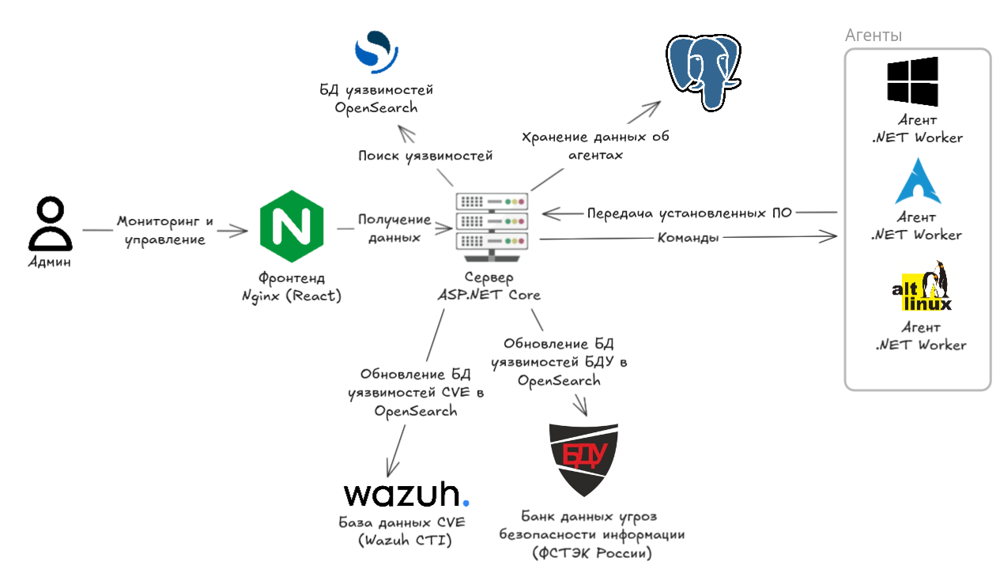

# scanvul

## Architecture


## How to start
1. Clone the repo
2. On the root of repo create self-signed certs for HTTPS:
    ```shell
    mkdir certs
    
    openssl req -x509 -nodes -days 365 -newkey rsa:2048 \
      -keyout certs/nginx-selfsigned.key \
      -out certs/nginx-selfsigned.crt
    ```
3. Fill `.env` file
    ```shell
    cp .env.template .env
    nvim .env # fill with data (for example: cat .env.dev)
    ```
4. Start server (Nginx + ASP.NET Core + Postgres + OpenSearch)
    ```shell
    docker compose up -d
    ```
5. Build agent installer (will create zip files on `build`) or download from releases
    ```shell
    ./build_agent.sh
    ```
6. Unzip installer and install agent on computer as administrator
    ```shell
    ./ScanVul.Agent.Installer --help
    sudo ./ScanVul.Agent.Installer --server http://<ip-addr-of-server>:5000/ # for Linux
    ```

## TODO:
- [x] create command line agent installer with service registering on windows and linux (systemd)
  - [x] exception when installing to computer where agent already exists
  - [x] use existing token when reinstalling 
- [x] CVE indexer microservice (opensearch)
- [x] main server api
  - [x] register agent
  - [x] version matching
    - [x] add BaseVersion (with segments split by \[.,-~:\]) that can be compared with all other version types 
  - [x] update CVEs snapshot
  - [x] vulnerable package scanning jobs management
  - [x] backend for frontend
  - [x] tasks to agents
  - [x] remove agent (task to remove)
  - [x] fix git 2.45.1 doesn't have [CVE](https://cti.wazuh.com/vulnerabilities/cves/CVE-2019-1003010). 
        Solution: vendor is jenkins with other version system, so I need to add feature to mark false positives   
  - [x] mark false positive vulnerabilities
- [ ] agent
  - [x] scrape packages on windows
  - [x] scrape packages on linux (alt linux)
  - [x] task management (short pooling)
    - [x] task to scan
    - [x] task to upgrade package (via chocolatey)
    - [x] task to stop (remove)
  - [ ] conditional compilation for different OSes
  - [ ] in-memory queue = Channel 
- [x] frontend
  - [x] agent's pc info
  - [x] vulnerable packages
  - [x] severity viewer
  - [x] task to upgrade package
    - [x] search from package manager
  - [x] i18n
  - [x] mark false positive vulnerabilities
  - [x] refactor (extract components)
  - [x] toastify
    - [x] command creation
    - [x] searching package
- [x] ФСТЭК
  - [x] convert xml to json
  - [x] recurring job to export to opensearch
  - [x] entity for BDU vulnerable package
  - [x] endpoint like for CVE
  - [x] block on frontend with BDU
- [x] change format of BDU documents' soft version info to like CVE documents'
- [ ] find more appropriate package searching method [link](https://docs.opensearch.org/latest/query-dsl/term/index/)
- [ ] rework version matching and comparing
  - [x] bdu: check package name firstly, after version
  - [x] bdu: BaseVersion with only numbers
  - [x] bdu: if BaseVersion with only numbers: i can check for equality
- [ ] test
  - [ ] has vulnerability → update → no vulnerability
  - [ ] version matching and comparing (unit tests)
- [ ] links to package managers as options
- [x] winget
  - [x] package manager searching
  - [x] installing packages on agent
  - [x] installing packages on linux agents
  - [x] warning on frontend when upgrading package on arch linux
  - [x] choosing package manager on frontend
- [x] deploy
  - [x] docker compose
  - [x] readme
- [x] vulnerability report on organization every morning in pdf (s3) 
  - [x] hangfire job to generate report
  - [x] block on frontend on main page
- [ ] lists with false-positive and patchless vulnerable packages
  - [ ] PatchExists - column to VulnerablePackage and BduVulnerablePackage
  - [ ] remember IsFalsePositive and PatchExists when scanning
  - [ ] API to mark/unmark PatchExists, IsFalsePositive
  - [ ] blocks on frontend with not PatchExists and IsFalsePositive
- [ ] snapshots
  - [ ] entities for snapshot (vulnerable packages with scoring by cvss), diff between snapshots (what vulnerable package added, removed)
  - [ ] snapshot for every scanning process (if no diff (changes), don't save??)
  - [ ] snapshot diffs for all organization's agents (to pdf)

